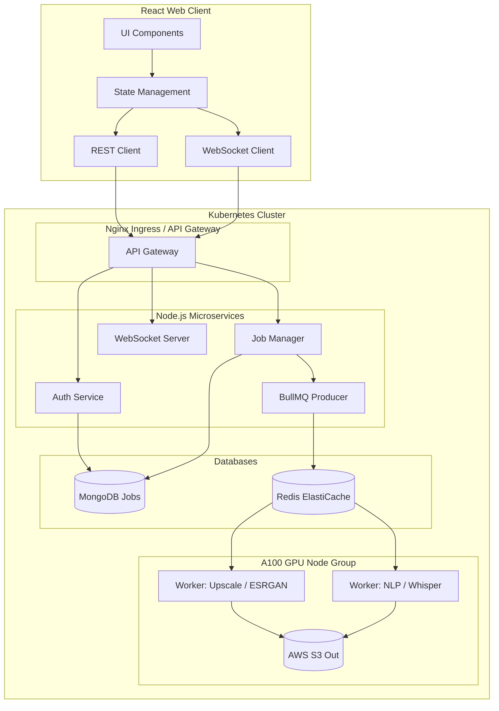

# 🚀 Smart Video Enhancer V3.0 (AI Media Intelligence Platform)


An **Enterprise-Grade AI Media Intelligence Platform** demonstrating Full-Stack Engineering, MLOps, Cloud-Native deployment, and advanced Deep Learning pipelines. V3.0 expands the core upscaler into an 8-module suite featuring AutoML, Model Marketplaces, A/B Testing, and Developer APIs.

---

## 🏗 Enterprise Cloud Architecture



## ✨ Major V3.0 Features

- **AI Media Suite**: 8 distinct tools including Video Enhancement, AI Subtitles, Voice Isolation, Scene Intelligence, and Background Removal.
- **MLOps & A/B Testing**: Track experiment loss metrics, evaluate longitudinal training charts, and visually compare Models A/B side-by-side.
- **AutoML Copilot**: An intelligent agent that pre-analyzes metadata/blur/lighting to recommend the perfect pipeline and estimate GPU processing time.
- **Developer API Portal**: Secure JWT endpoint authentication, API key generation, and rate-limiting dashboards.
- **Enterprise RBAC**: Administrator panel with Role-Based Access Control and a live security Audit Log.
- **Infrastructure Monitoring**: Grafana/Prometheus styled live UI charting simulated cluster CPU, GPU VRAM, and Redis Job Queues.

## 🏗️ Architecture Stack

- **Frontend**: React (Vite), Framer Motion, Tailwind CSS principles, Recharts, jsPDF
- **Backend API**: Node.js, Express, JWT Auth, Multer
- **Queueing Engine**: Redis & BullMQ
- **Database**: MongoDB & Mongoose
- **AI Worker Node**: Python 3, PyTorch, OpenCV, FFmpeg
- **Real-Time Engine**: Socket.IO

## 🚀 Getting Started

### 1. Requirements
- Docker Desktop
- Node.js v18+
- Python 3.10+
- FFmpeg (Must be in system PATH)

### 2. Infrastructure
Start the Redis and MongoDB containers:
```bash
docker-compose up -d
```

### 3. Backend & AI Engines
```bash
cd backend
npm install
npm start
```
*Note: The Python models are pre-stubbed for demonstration purposes. If you wish to use real models, drop the weights into `/ai_service/models/` and install `torch`.*

### 4. Frontend Studio
```bash
cd frontend
npm install
npm run dev
```

Visit `http://localhost:5173` to access the neural engine dashboard!

## 📜 License
MIT License
